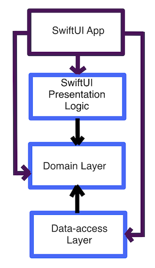
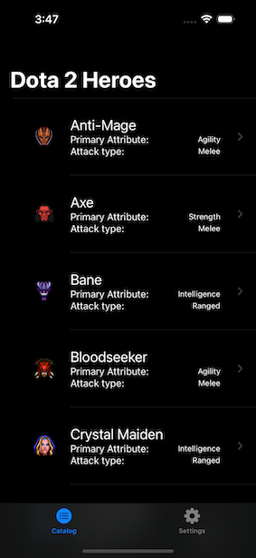
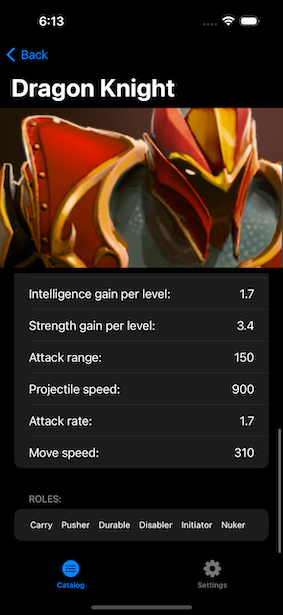
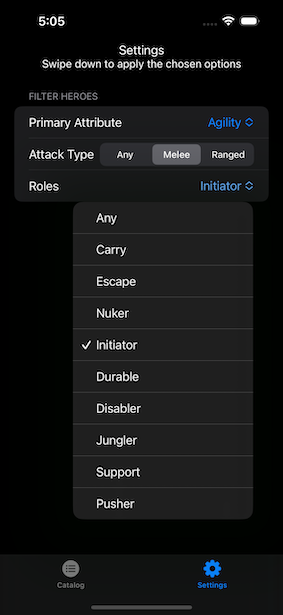
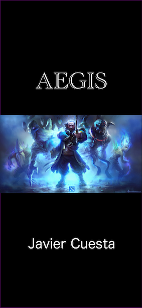

# Aegis
 By Javier Cuesta
# Introduction

*Aegis* is an iOS app for demonstrating software design techniques. It uses dependency injection (DI in short) with the MVVM architecture and SwiftUI. The App allows users to browse the catalog of current heroes from the [Open source Dota 2 data platform](https://www.opendota.com) and see the heroes base stats.

# Build Tools & Versions Used

I developed *Aegis* using Xcode 14.2, iOS 16.2, and the [Swift Package Manager](https://www.swift.org/package-manager/). For this project, I tried to follow the coding style of the [standard library](https://github.com/apple/swift/blob/main/docs/StandardLibraryProgrammersManual.md) where it made sense.

# Discussion

The benefit of a well-designed, loosely coupled system is extensible, testable, and maintainable software. Moreover, it increases parallel development. Dependency Injection (DI) techniques provide all these benefits and *late binding* (the capacity of swapping a service with another service without recompiling other modules). The DI approach will lead to quite a few more structs and classes. This is a consequence of separating the application concerns. This really pay-off as the application and its requirements grow. *Aegis* is of course, not an enterprise application. The focus here is to show guiding principles for building an extensible, testable, and maintainable application using "pure" dependency injection. The adjective *pure* just means that we do not use any DI tooling (a so-called "DI Container"), but follow the SOLID principles. In particular, the dependency inversion principle plays an important role here. The DI techniques used are constructor injection *and* composition root.

The *Aegis* App consists of three layers ([domain](https://github.com/jcubit/HeroDomain), [data-access](https://github.com/jcubit/HeroDataAccess) and UI) with a SwiftUI App client that acts as the composition root. The UI Layer and App client are contained in this repository. The following diagram is the dependency graph of *Aegis*. Notice the direction of the arrows

  

Of course, anyone can draw a three-layer diagram and claim its design is loosely coupled. So to demonstrate that this application has this dependency graph, the domain and data-access layers are compiled in separate Swift packages. The Swift Package Manifest embodies the dependencies between the layers and enforces them. Here we can see how parallel development and late binding could work. Say that we want to deploy two versions of the same application, where one fetches the data from a web request, and the other is hosted somewhere else and uses a relational database. The developers working on the implementation details of those components make only changes inside the data-access layer without affecting the domain nor UI layers. Concerning implementation details, I used an asynchronous image loader with a cache in the data-access layer. It takes advantage of async load of images via the `async/await` concurrency model available since Swift 5.7.

Finally, each layer has separate *unit tests* accompanying their Swift-Package and the Xcode project.
  

# Screenshots and gif

   | Catalog | Stats |
 | -------- | ------- |
 |  |  |

 | Settings | Splash |
 | -------- | ------- |
 |  |  |

The filter options can be seen in the following gif

# Credits

Dota, the Dota 2 logo, and Defense of the Ancients are trademarks and/or registered trademarks of Valve Corporation.

Dependency Injection principles are discussed in depth in Steven van Deursen and Mark Seemanns' outstanding [book](https://www.manning.com/books/dependency-injection-principles-practices-patterns). In particular, they discuss the importance of the composition root and missconceptions about DI.

The "Blue Team" image is from [Mike Azevedo](https://www.artstation.com/artist/mikeazevedo)

I learned how to integrate files when using XCTest in a Swift Package from the SPI [utils](https://forums.swift.org/t/how-can-i-access-a-file-inside-of-an-xctestcase/53424/5). In addition, I learned how to build state machines in Swift from this excellent [talk](https://www.youtube.com/watch?v=7UC7OUdtY_Q).
